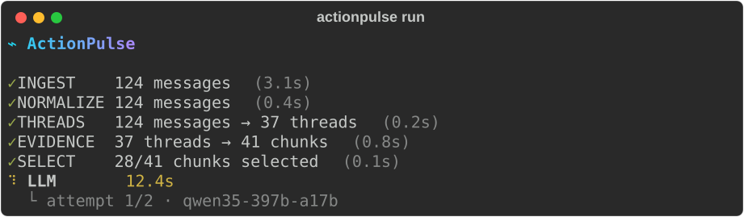
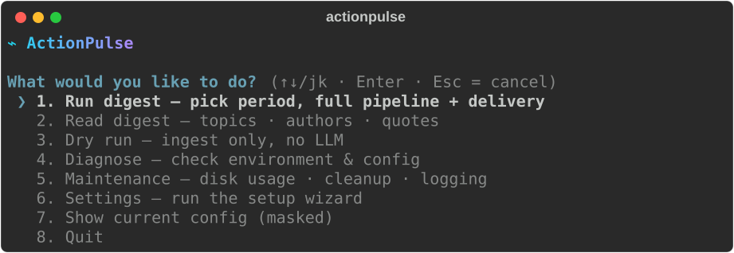
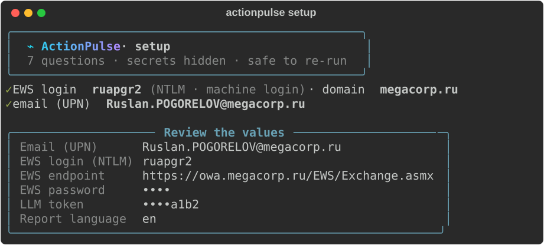

# ActionPulse

**Daily pulse of actions from your inbox.**

Every morning — an automatic digest of your corporate email: what people expect from you, what is urgent, what was decided without you. Every item traces back to the original email.

## What it looks like

A run shows every pipeline stage funnelling the inbox down to actions, live on one footer:

<p align="center"></p>

Bare `actionpulse` opens an arrow-key menu; the setup wizard auto-detects what it can and asks only for the rest:

<p align="center">
  
  
</p>

> These are real `Console.export_svg()` renders of the actual output (regenerate with `docs/assets/generate_screenshots.py`), not mockups. Terminal styling per [`docs/development/TERMINAL_DESIGN.md`](docs/development/TERMINAL_DESIGN.md).

---

## What it is

A single-tenant CLI tool. It reads your Exchange inbox, runs it through an 8-stage pipeline, and delivers the result to Mattermost via an **incoming webhook** (the target channel is chosen when the webhook is created in Mattermost).

**Not a summarizer** — the LLM extracts facts from evidence, it does not write on its own. Three output sections:
- **My actions** — what is expected from you
- **Urgent** — deadlines ≤2 business days
- **FYI** — what was decided without you

**Not SaaS** — runs on corporate infrastructure; data never leaves the perimeter.

Reports are English by default; switch to Russian with `report.language: ru` in `configs/config.yaml` (the setup wizard asks).

---

## Quick start

One command on a fresh macOS — no preinstalled Python, no Homebrew:

```bash
/bin/bash -c "$(curl -fsSL https://raw.githubusercontent.com/pogorelov-labs/ActionPulse/main/install.sh)"
```

The script checks the environment, installs [uv](https://docs.astral.sh/uv/) (which downloads Python 3.11 itself — your system Python version does not matter), clones the repository into `~/ActionPulse`, installs dependencies, and launches the setup wizard in the same terminal window. Re-running is safe: it updates the code and offers current values as the default answers. Flags: `--dir`, `--ref`, `--no-wizard` (headless).

<details>
<summary>Manual install (git clone + make)</summary>

```bash
git clone https://github.com/pogorelov-labs/ActionPulse.git
cd ActionPulse/digest-core

# Install dependencies + interactive wizard (7 questions, no file editing)
make setup
```

</details>

After installation the **`actionpulse`** command is available everywhere (a launcher in `~/.local/bin`). Secrets load automatically from `~/.config/actionpulse/env` — no manual `source` needed:

```bash
actionpulse               # interactive menu: Run · Dry run · Diagnose · Settings · Show config
actionpulse run --dry-run # ingest + normalize only, no LLM
actionpulse run           # full pipeline + delivery
actionpulse diagnose      # check environment & config
actionpulse setup         # re-run the configuration wizard
```

> If `actionpulse` isn't found, `~/.local/bin` isn't on your PATH yet — open a new terminal, or add it: `echo 'export PATH="$HOME/.local/bin:$PATH"' >> ~/.zshrc && exec $SHELL`. The classic `cd ~/ActionPulse/digest-core && uv run python -m digest_core.cli …` invocation still works too.

The wizard asks for: corporate email, EWS endpoint, EWS password, LLM endpoint, LLM token, Mattermost webhook URL, and the report language (`en` default / `ru`). Before asking, it auto-detects your machine login (the EWS NTLM identity, e.g. `ruapgr2` — note this differs from the email local part), your name, and corp-email candidates (a local Keychain metadata scan — Keychain secrets stay encrypted and unreadable) and auto-confirms validated values; the final review screen is always shown (`--no-autodetect` disables detection). It generates `~/.config/actionpulse/env` (chmod 600) and `configs/config.yaml`. To reconfigure: `actionpulse setup` (or `make setup` from `digest-core/` — the same wizard; it also installs the `actionpulse` launcher when missing).

If you see `No module named 'digest_core'`, the command ran under the system Python outside the project environment. Use `uv run python -m ...` (as in the examples above) or activate `.venv` manually.

### Mattermost integration (important)
ActionPulse uses a Mattermost **incoming webhook** to **deliver** the finished digest (Stage 8). It does not read messages or DMs — the MVP uses no "reading" API/WebSocket.

Details: [`digest-core/CLAUDE.md`](digest-core/CLAUDE.md).

---

## Architecture

```
Exchange (EWS)
    └── INGEST → NORMALIZE → THREADS → EVIDENCE → SELECT → LLM → ASSEMBLE → DELIVER
                                                                               └── Mattermost (webhook)
```

LLM: `qwen35-397b-a17b` via the corporate gateway, 15 RPM, **max 2 calls per run** (1 primary extraction + an optional quality retry, see ADR-008).

Full stage contracts: [`digest-core/docs/ARCHITECTURE.md`](digest-core/docs/ARCHITECTURE.md).

---

## Principles

| | |
|--|--|
| **Extract-over-Generate** | The LLM extracts from evidence; every item is bound to an `evidence_id` |
| **Traceability** | Item → `evidence_id` → `source_ref` → the original email |
| **Privacy-first** | The local PII-masking module was removed in 1.1.0; personal-data handling lives in the corporate LLM Gateway. Email bodies and secrets are never written to logs |
| **Idempotency** | Artifacts per chosen date: re-runs within a **T−48h** window skip the rebuild when JSON/MD are already fresh (`run --force` bypasses the check) |

---

## Development

```bash
cd digest-core
make test    # all tests (mocked, no network)
make lint
make smoke   # dry-run smoke test
```

EWS and the LLM Gateway are reachable only from the corp network. For development outside the perimeter:

```bash
# Capture an inbox snapshot from inside
python -m digest_core.cli run --dump-ingest /tmp/snapshot.json

# Replay it outside
python -m digest_core.cli run --replay-ingest /tmp/snapshot.json
```

Terminal output rules: [`docs/development/TERMINAL_DESIGN.md`](docs/development/TERMINAL_DESIGN.md); execution plan: [`docs/development/TERMINAL_DESIGN_ROADMAP.md`](docs/development/TERMINAL_DESIGN_ROADMAP.md).

---

## License

Internal corporate use only.
